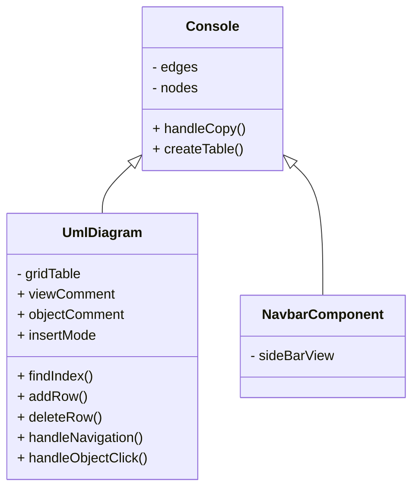

# Software Design

### Folder Structure

The folder is organised as a module:
the code cna be found in the `src` folder, `documents` like the design_doc.md file and the readme pictures can be found

The source code folder is organised into 5 main sections, `assets` where images and static assets are kept, `__test__` where all the tests are kept, `apis` where the api interfaces are specified, `pages` where the code for the page is kept, `containers` where stateful react components are specified and `components` where all the re-usable components are found.

#### Design Overview

the following diagram displays the main react components



#### Console Design

**view**
The view of the react component is divided into 2 sections using the HTML `<section/>` tag.

The first section contains the `NavComponent` which uses the `createTable` and the `handleCopy` which are used by the container to modify its internal state.

The second section contains the react flow grid which uses `UmlDiagrams` as nodes:

```jsx
const nodeTypes = { umlDiagram: UmlDiagram };
```

**state**
The react component uses the following data structure stored in the node state, 
```jsx
{
  id: `node-${nodes.length + 1}`,
  type: "umlDiagram",
  position: { x: 10, y: 10 },
  data: {
    objectName: "Object Name",
    comment: "Object Description",
    color: getRandomColor(),
    gridTable: [
      {
        visibility: "+",
        signature: "",
        type: "",
        comment: "signature description",
      },
    ],
  },
},
```
this data structure is passed to the ``UmlDiagram`` component using the prop ``data``. It is then modified using the ``addRow``, ``deleteRow`` , ``handleObjectClick`` methods.

expand on how the data structure cna be modified
expand on the nodes
